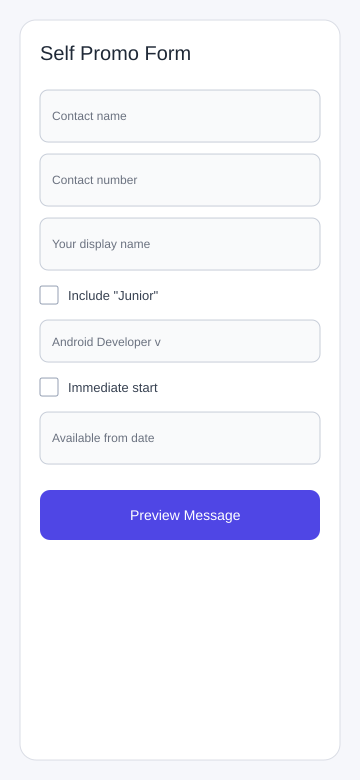
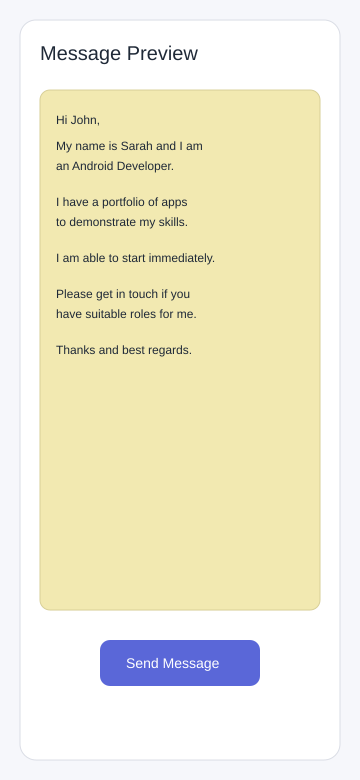

# TheshemalessselfPromoApp

A simple Android app that helps you generate a professional self-promo text message and send it directly via SMS.

## Screenshots

| Main Form | Message Preview |
| --- | --- |
|  |  |

## Features

- Collects contact name and phone number
- Captures your display name and preferred Android role
- Supports junior-role wording and availability options
- Generates a ready-to-send self-promo message preview
- Launches SMS apps with prefilled message content

## Tech Stack

- Kotlin
- Android Views + XML layouts
- Material Components
- Gradle (Kotlin DSL)

## Project Structure

- `app/src/main/java/com/example/selfpromoapp/MainActivity.kt`: input form screen
- `app/src/main/java/com/example/selfpromoapp/PreviewActivity.kt`: generated message preview and SMS intent
- `app/src/main/java/com/example/selfpromoapp/Message.kt`: message model and formatting helpers
- `app/src/main/res/layout/activity_main.xml`: form UI
- `app/src/main/res/layout/activity_preview.xml`: preview UI

## Run Locally

1. Open the project in Android Studio.
2. Let Gradle sync finish.
3. Start an emulator (API 31+) or connect a physical Android device.
4. Click **Run** in Android Studio.

Or use Gradle from terminal:

```bash
./gradlew assembleDebug
```

## Notes

- The project currently targets `compileSdk 36`, `targetSdk 35`, and `minSdk 31`.
- Screenshots are included in `docs/screenshots/`.
